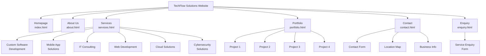

# TechFlow Solutions Website

## Student Information

*   **Name:** Lubo Mbuyu
*   **Student ID:** ST10467547
*   **Course:** WED5020
*   **Institution:** Varcity College Westville

## Project Overview

A comprehensive, responsive website for TechFlow Solutions - a fictional IT services company specializing in custom software development, mobile apps, IT consulting, web development, cloud solutions, and cybersecurity. This project serves as a practical application of front-end web development skills, focusing on creating a professional, user-friendly, and aesthetically pleasing online presence for a business.

## Website Goals and Objectives

### Goals
The primary goal is to design and develop a fully functional, responsive, and professional-looking website that effectively showcases the services and portfolio of TechFlow Solutions, encouraging potential clients to make an enquiry.

### Objectives
*   To create a clean, modern, and intuitive user interface.
*   To ensure the website is fully responsive and accessible across various devices (desktops, tablets, and mobiles).
*   To clearly present the company's services, portfolio, and background information.
*   To provide easy-to-use contact and enquiry forms for lead generation.
*   To build the website using semantic HTML, modular CSS, and vanilla JavaScript, following best practices in web development.

## Key Features and Functionality

### Pages & Functionality
*   **Homepage**: Hero banner, services overview with carousel, call-to-action buttons.
*   **Services**: Detailed service descriptions and pricing information.
*   **Portfolio**: Project showcase with case studies.
*   **About**: Company information and team details.
*   **Contact**: Contact form, location map, and business information.
*   **Enquiry**: A dedicated service enquiry form with validation.

### Technical Features
*   Responsive design for all screen sizes (Mobile-first approach).
*   Dynamic navigation menu for easy site-wide navigation.
*   Interactive service carousel on the homepage.
*   Google Maps integration on the contact page.
*   Client-side form validation for enquiry and contact forms.
*   Lazy loading for images to improve performance.
*   SEO-optimized structure with semantic HTML.
*   Adherence to accessibility standards (ARIA labels, keyboard navigation).

## Timeline and Milestones

*   **Part 1: Website Structure and Foundation (Completed)**
    *   **Milestone 1:** Project planning, sitemap, and wireframing.
    *   **Milestone 2:** Development of all core HTML pages with semantic structure.
    *   **Milestone 3:** Implementation of modular CSS for global and page-specific styling.
    *   **Milestone 4:** Basic JavaScript for dynamic components (navigation, carousel).
    *   **Milestone 5:** Finalized content and assets for Part 1 submission.

*   **Part 2: Advanced Interactivity and Refinement (Future)**
    *   **Milestone 6:** Enhance JavaScript functionality and user interactions.
    *   **Milestone 7:** Refine CSS, add animations and transitions.
    *   **Milestone 8:** Conduct cross-browser and device testing.

*   **Part 3: Backend Integration and Deployment (Future)**
    *   **Milestone 9:** Develop backend logic for form submissions.
    *   **Milestone 10:** Integrate a database for portfolio and blog content.
    *   **Milestone 11:** Final deployment to a live server.

## Part 1 Details

This section covers the technical implementation and structure for Part 1 of the project.

### Project Structure

```
TechFlow-Solutions/
├── 📄 HTML Files
│   ├── index.html          # Homepage with hero banner and services overview
│   ├── about.html          # About Us page
│   ├── services.html       # Detailed services and pricing
│   ├── portfolio.html      # Portfolio showcase
│   ├── contact.html        # Contact information and form
│   ├── enquiry.html        # Service enquiry form
│   └── file-organization-plan.html # Project structure documentation
│
├── 🎨 CSS Directory (css/)
│   ├── styles.css          # Main stylesheet with global styles
│   ├── index.css           # Homepage-specific styles
│   ├── services.css        # Services page styles
│   ├── contact.css         # Contact page styles
│   ├── portfolio.css       # Portfolio page styles
│   ├── about.css           # About page styles
│   └── enquiry.css         # Enquiry form styles
│
├── ⚡ JavaScript Directory (js/)
│   ├── navigation.js       # Dynamic navigation menu
│   ├── address.js          # Contact information management
│   ├── footer.js           # Footer content and functionality
│   ├── head.js             # Head section content
│   ├── top.js              # Back-to-top functionality
│   ├── maps.js             # Google Maps integration
│   ├── carousel.js         # Services carousel functionality
│   └── service-enquiry.js  # Enquiry form handling
│
├── 🖼️ Images Directory (images/)
│   ├── logo.jpeg           # Company logo
│   ├── Custom service icons (software, mobile, consulting, web, cloud, security)
│   ├── Page screenshots
│   ├── Wireframes
│   ├── Sitemaps
│   └── Favicon and branding assets
│
└── 📄 Documentation
    ├── README.md           # This file
    └── TODO.md            # Development tasks and progress
```

### Technologies Used

*   **Frontend**: HTML5, CSS3, Vanilla JavaScript
*   **Design**: Responsive design, Mobile-first approach
*   **Styling**: CSS Grid, Flexbox, CSS Variables
*   **Performance**: Lazy loading, Optimized assets
*   **Accessibility**: Semantic HTML, ARIA labels, Keyboard navigation

### Design System

*   **Color Palette**: Professional blue and orange scheme.
*   **Typography**: Roboto for body text, Montserrat for headings.
*   **Layout**: Grid and Flexbox for responsive layouts.
*   **Components**: Modular, reusable UI components created with HTML, CSS, and JS.
*   **Icons**: Custom service icons and other visual elements.

### Architecture

*   **Frontend Structure**: Semantic HTML5, Responsive CSS3, Vanilla JavaScript.
*   **Design System**: CSS Variables, Mobile-First, Component-Based.
*   **File Organization**: Modular structure with separate files for each page's styles and distinct JavaScript functionalities.
*   **Performance**: Optimized asset loading and progressive enhancement techniques.

## 🗺️ Sitemap



## Changelog

### v1.0.0 - (Submission Date for Part 1)
*   **Initial Commit:** Project setup and file structure created.
*   **HTML:** All 7 HTML pages (`index`, `about`, `services`, `portfolio`, `contact`, `enquiry`, `file-organization-plan`) have been created with semantic markup.
*   **CSS:** Modular CSS files created. Implemented global styles, responsive layouts using Flexbox and Grid, and page-specific styling.
*   **JavaScript:** Added scripts for dynamic navigation, footer, back-to-top button, and interactive elements like the services carousel.
*   **Assets:** All necessary images, icons, and branding assets have been added and optimized.
*   **Documentation:** `README.md` and `TODO.md` created.

## References

*(This section should be populated with all sources used, such as tutorials, code snippets, libraries, images, etc., using a recognized referencing style like Harvard or APA.)*

**Example:**

*   W3Schools. (2023). *CSS Flexbox*. Retrieved from https://www.w3schools.com/css/css3_flexbox.asp
*   Mozilla Developer Network. (2023). *Using Fetch*. Retrieved from https://developer.mozilla.org/en-US/docs/Web/API/Fetch_API/Using_Fetch
