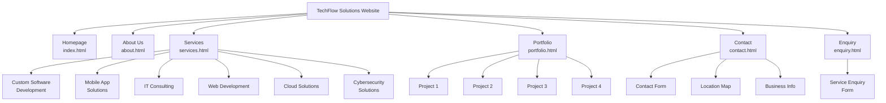

# TechFlow Solutions Website

## Student Information

*   **Name:** Lubo Mbuyu
*   **Student ID:** ST10467547
*   **Course:** WED5020
*   **Institution:** Varcity College Westville

## Project Overview

A comprehensive, responsive website for TechFlow Solutions – a fictional IT services company specializing in custom software development, mobile apps, IT consulting, web development, cloud solutions, and cybersecurity.

This project demonstrates front-end web development skills, focusing on building a professional and user-friendly online presence for a business.

## Website Goals and Objectives

### Goals
The primary goal is to design and develop a fully functional, responsive, and professional-looking website that effectively showcases the services and portfolio of TechFlow Solutions, encouraging potential clients to make an enquiry.

### Objectives
*   To create a clean, modern, and intuitive user interface.
*   To ensure the website is fully responsive and accessible across various devices (desktops, tablets, and mobiles).
*   To clearly present the company's services, portfolio, and background information.
*   To provide easy-to-use contact and enquiry forms for lead generation.
*   To build the website using semantic HTML, modular CSS, and vanilla JavaScript, following best practices in web development.

## Key Features and Functionality

### Pages & Functionality
*   **Homepage**: Hero banner, services overview with carousel, call-to-action buttons.
*   **Services**: Detailed service descriptions and pricing information.
*   **Portfolio**: Project showcase with case studies.
*   **About**: Company information and team details.
*   **Contact**: Contact form, location map, and business information.
*   **Enquiry**: A dedicated service enquiry form with validation.

### Technical Features
*   Responsive design for all screen sizes (Mobile-first approach).
*   Dynamic navigation menu for easy site-wide navigation.
*   Interactive service carousel on the homepage.
*   Google Maps integration on the contact page.
*   Client-side form validation for enquiry and contact forms.
*   Lazy loading for images to improve performance.
*   SEO-optimized structure with semantic HTML.
*   Adherence to accessibility standards (ARIA labels, keyboard navigation).

## Timeline and Milestones

*   **Part 1: Website Structure and Foundation (Completed)**
    *   **Milestone 1:** Project planning, sitemap, and wireframing.
    *   **Milestone 2:** Development of all core HTML pages with semantic structure.
    *   **Milestone 3:** Implementation of modular CSS for global and page-specific styling.
    *   **Milestone 4:** Basic JavaScript for dynamic components (navigation, carousel).
    *   **Milestone 5:** Finalized content and assets for Part 1 submission.

*   **Part 2: Designing the Visuals - CSS Styling and Responsive Design (Completed)**
    *   **Milestone 6:** Enhanced CSS with comprehensive styling system using CSS variables.
    *   **Milestone 7:** Implemented advanced responsive design with mobile-first approach.
    *   **Milestone 8:** Added mobile sidebar navigation with hamburger menu.
    *   **Milestone 9:** Applied visual enhancements, animations, and transitions.
    *   **Milestone 10:** Conducted cross-browser and device testing.
    *   **Milestone 11:** Updated documentation and prepared for Part 2 submission.

*   **Part 3: Backend Integration and Deployment (Future)**
    *   **Milestone 12:** Develop backend logic for form submissions.
    *   **Milestone 13:** Integrate a database for portfolio and blog content.
    *   **Milestone 14:** Final deployment to a live server.

## Part 1 Details

This section covers the technical implementation and structure for Part 1 of the project.

## Part 2 Details: Designing the Visuals - CSS Styling and Responsive Design

This section covers the advanced CSS styling, responsive design enhancements, and mobile navigation implementation for Part 2 of the project.

### Enhanced CSS Architecture

#### CSS Variables System
- **Color Palette**: Comprehensive color scheme with primary, secondary, accent, and semantic colors
- **Typography**: Consistent font families (Montserrat for headings, Roboto for body text)
- **Spacing**: Standardized spacing scale using rem units
- **Shadows**: Multiple shadow levels for depth and visual hierarchy
- **Transitions**: Consistent transition timing and easing functions

#### Advanced Responsive Design
- **Mobile-First Approach**: Base styles for mobile, enhanced for larger screens
- **Breakpoint Strategy**: Desktop (>1024px), Tablet (768-1024px), Mobile (<768px)
- **Flexible Layouts**: CSS Grid and Flexbox for complex responsive layouts
- **Relative Units**: em/rem for scalable typography and spacing

### Mobile Navigation System

#### Hamburger Menu Implementation
- **Hamburger Icon**: Three-line menu that transforms to X when active
- **Smooth Animations**: CSS transitions for icon transformation
- **Accessibility**: Proper ARIA labels and keyboard navigation support

#### Sidebar Navigation
- **Slide-in Animation**: Sidebar slides from left with smooth CSS transitions
- **Overlay Background**: Dark overlay covers content when sidebar is open
- **Auto-close Functionality**: Closes on overlay click, navigation link click, or escape key
- **Body Scroll Prevention**: Prevents background scrolling when sidebar is open

#### Cross-Page Consistency
- **Applied to All Pages**: Consistent mobile navigation across all HTML files
- **Responsive Behavior**: Only shows on mobile devices (≤767px)
- **Desktop Fallback**: Desktop navigation remains unchanged

### Visual Enhancements

#### Interactive Elements
- **Hover States**: Enhanced hover effects for buttons, links, and cards
- **Focus Indicators**: Clear focus states for keyboard navigation
- **Button Animations**: Subtle lift effects and color transitions
- **Card Hover Effects**: Shadow and transform effects for service/portfolio cards

#### Typography Hierarchy
- **Font Scale**: Consistent heading sizes (h1-h6) with proper line heights
- **Text Contrast**: High contrast ratios for accessibility compliance
- **Letter Spacing**: Optimized spacing for readability

#### Layout Improvements
- **Container System**: Max-width containers with responsive padding
- **Grid Systems**: Flexible grid layouts for content organization
- **Spacing Consistency**: Standardized margins and padding throughout

### Performance Optimizations

#### CSS Organization
- **Modular Structure**: Separate files for global and page-specific styles
- **CSS Variables**: Efficient color and value management
- **Minified Delivery**: Optimized CSS for production

#### Responsive Images
- **Lazy Loading**: Implemented lazy loading for performance
- **Responsive Images**: Proper srcset and sizes attributes
- **Optimized Assets**: Compressed images for faster loading

### Accessibility Enhancements

#### Keyboard Navigation
- **Focus Management**: Clear focus indicators and logical tab order
- **Skip Links**: Navigation shortcuts for screen readers
- **ARIA Labels**: Proper labeling for assistive technologies

#### Color Contrast
- **WCAG Compliance**: AA level contrast ratios throughout
- **Color Independence**: Design works without color reliance
- **Text Alternatives**: Alt text for all images

### Browser Compatibility

#### Cross-Browser Testing
- **Modern Browsers**: Chrome, Firefox, Safari, Edge
- **CSS Fallbacks**: Graceful degradation for older browsers
- **Vendor Prefixes**: Appropriate prefixes for CSS properties

#### Device Testing
- **Mobile Devices**: iOS Safari, Android Chrome
- **Tablet Devices**: iPad, Android tablets
- **Desktop Resolutions**: Various screen sizes and aspect ratios

### Technical Implementation Details

#### CSS Grid and Flexbox Usage
- **Complex Layouts**: Grid for main page structures
- **Component Layouts**: Flexbox for navigation, cards, and forms
- **Responsive Grids**: Auto-fit and minmax for flexible columns

#### Animation and Transitions
- **Performance**: Hardware-accelerated CSS transforms
- **Timing**: Consistent easing curves and durations
- **Purposeful Motion**: Meaningful animations that enhance UX

#### Form Styling
- **Input States**: Focus, hover, and validation states
- **Consistent Design**: Unified form element styling
- **Error Handling**: Visual feedback for form validation

### Quality Assurance

#### Testing Methodology
- **Manual Testing**: Cross-device and cross-browser verification
- **Responsive Testing**: Browser developer tools and real devices
- **Accessibility Testing**: Screen reader and keyboard navigation testing

#### Documentation Updates
- **README Enhancement**: Comprehensive Part 2 documentation
- **Changelog Maintenance**: Detailed version history
- **Code Comments**: Well-documented CSS and JavaScript

### Part 2 Deliverables

#### Files Modified
- **HTML Files**: Added mobile navigation elements to all pages
- **CSS Files**: Enhanced styles.css with comprehensive styling system
- **JavaScript Files**: Updated navigation.js with mobile menu functionality
- **Documentation**: Updated README.md and TODO.md

#### Key Features Delivered
1. ✅ Comprehensive CSS Variables System
2. ✅ Advanced Responsive Design Implementation
3. ✅ Mobile Sidebar Navigation
4. ✅ Enhanced Visual Design
5. ✅ Accessibility Improvements
6. ✅ Cross-Browser Compatibility
7. ✅ Performance Optimizations
8. ✅ Documentation Updates

### Project Structure

```
TechFlow-Solutions/
├── 📄 HTML Files
│   ├── index.html          # Homepage with hero banner and services overview
│   ├── about.html          # About Us page
│   ├── services.html       # Detailed services and pricing
│   ├── portfolio.html      # Portfolio showcase
│   ├── contact.html        # Contact information and form
│   ├── enquiry.html        # Service enquiry form
│   └── file-organization-plan.html # Project structure documentation
│
├── 🎨 CSS Directory (css/)
│   ├── styles.css          # Main stylesheet with global styles
│   ├── index.css           # Homepage-specific styles
│   ├── services.css        # Services page styles
│   ├── contact.css         # Contact page styles
│   ├── portfolio.css       # Portfolio page styles
│   ├── about.css           # About page styles
│   └── enquiry.css         # Enquiry form styles
│
├── ⚡ JavaScript Directory (js/)
│   ├── navigation.js       # Dynamic navigation menu
│   ├── address.js          # Contact information management
│   ├── footer.js           # Footer content and functionality
│   ├── head.js             # Head section content
│   ├── top.js              # Back-to-top functionality
│   ├── maps.js             # Google Maps integration
│   ├── carousel.js         # Services carousel functionality
│   └── service-enquiry.js  # Enquiry form handling
│
├── 🖼️ Images Directory (images/)
│   ├── logo.jpeg           # Company logo
│   ├── Custom service icons (software, mobile, consulting, web, cloud, security)
│   ├── Page screenshots
│   ├── Wireframes
│   ├── Sitemaps
│   └── Favicon and branding assets
│
└── 📄 Documentation
    ├── README.md           # This file
    └── TODO.md            # Development tasks and progress
```

### Technologies Used

*   **Frontend**: HTML5, CSS3, Vanilla JavaScript
*   **Design**: Responsive design, Mobile-first approach
*   **Styling**: CSS Grid, Flexbox, CSS Variables
*   **Performance**: Lazy loading, Optimized assets
*   **Accessibility**: Semantic HTML, ARIA labels, Keyboard navigation

### Design System

*   **Color Palette**: Professional blue and orange scheme.
*   **Typography**: Roboto for body text, Montserrat for headings.
*   **Layout**: Grid and Flexbox for responsive layouts.
*   **Components**: Modular, reusable UI components created with HTML, CSS, and JS.
*   **Icons**: Custom service icons and other visual elements.

### Architecture

*   **Frontend Structure**: Semantic HTML5, Responsive CSS3, Vanilla JavaScript.
*   **Design System**: CSS Variables, Mobile-First, Component-Based.
*   **File Organization**: Modular structure with separate files for each page's styles and distinct JavaScript functionalities.
*   **Performance**: Optimized asset loading and progressive enhancement techniques.

## 🗺️ Sitemap



## Changelog

### v2.0.0 - Part 2: Designing the Visuals (Submission Date for Part 2)
*   **Enhanced CSS Architecture:** Implemented comprehensive CSS variables system with color palette, typography, spacing, and shadows.
*   **Advanced Responsive Design:** Applied mobile-first approach with breakpoints for desktop (>1024px), tablet (768-1024px), and mobile (<768px).
*   **Mobile Navigation System:** Added hamburger menu with slide-in sidebar navigation, overlay, and accessibility features.
*   **Visual Enhancements:** Applied hover states, focus indicators, button animations, and card hover effects.
*   **Typography Improvements:** Established consistent font hierarchy with Montserrat for headings and Roboto for body text.
*   **Layout Refinements:** Enhanced container system, grid layouts, and spacing consistency across all pages.
*   **Accessibility Updates:** Improved keyboard navigation, ARIA labels, and WCAG AA compliance.
*   **Performance Optimizations:** Implemented lazy loading, responsive images, and optimized CSS delivery.
*   **Cross-Browser Compatibility:** Tested and ensured compatibility with Chrome, Firefox, Safari, and Edge.
*   **Documentation:** Updated README.md and TODO.md with comprehensive Part 2 details.

### v1.0.0 - Part 1: Website Structure and Foundation (Submission Date for Part 1)
*   **Initial Commit:** Project setup and file structure created.
*   **HTML:** All 7 HTML pages (`index`, `about`, `services`, `portfolio`, `contact`, `enquiry`, `file-organization-plan`) have been created with semantic markup.
*   **CSS:** Modular CSS files created. Implemented global styles, responsive layouts using Flexbox and Grid, and page-specific styling.
*   **JavaScript:** Added scripts for dynamic navigation, footer, back-to-top button, and interactive elements like the services carousel.
*   **Assets:** All necessary images, icons, and branding assets have been added and optimized.
*   **Documentation:** `README.md` and `TODO.md` created.

### v1.3.0 – JavaScript Functionality

Added dynamic navigation bar

Implemented back-to-top button

Created services carousel

### v1.2.0 – Assets & Styles

Linked external CSS stylesheet

Added initial layout styles (Flexbox + Grid)

Uploaded images and icons (logo, service icons, wireframes, sitemap)

### v1.1.0 – Content Updates

Added company overview and service descriptions

Updated h1 and section headings for consistency

### v1.0.0 – Initial Commit

Set up project structure

Added semantic HTML pages (index, about, services, portfolio, contact, enquiry, file-organization-plan)

## References

W3Schools. (2023). CSS Flexbox. Retrieved from: https://www.w3schools.com/css/css3_flexbox.asp

Mozilla Developer Network. (2023). Using Fetch. Retrieved from: https://developer.mozilla.org/en-US/docs/Web/API/Fetch_API/Using_Fetch

Freepik. (2024). Icons and Vector Assets. Retrieved from: https://www.freepik.com/

Unsplash. (2024). Royalty-Free Images. Retrieved from: https://unsplash.com/

Google Fonts. (2024). Roboto and Montserrat Fonts. Retrieved from: https://fonts.google.com/

## 📸 Content Sourcing

Public Domain and Creative Commons Resources: Free images, icons, and fonts sourced from Unsplash, Freepik, and Google Fonts.

Original Content: Text descriptions (company overview, services, portfolio examples) were researched and written by the student.


