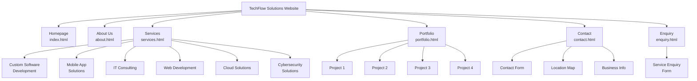

# TechFlow Solutions Website

A comprehensive, responsive website for TechFlow Solutions - an IT services company specializing in custom software development, mobile apps, IT consulting, web development, cloud solutions, and cybersecurity.

## 🗺️ Website Sitemap



## 📁 Project Structure

```
TechFlow-Solutions/
├── 📄 HTML Files
│   ├── index.html          # Homepage with hero banner and services overview
│   ├── about.html          # About Us page
│   ├── services.html       # Detailed services and pricing
│   ├── portfolio.html      # Portfolio showcase
│   ├── contact.html        # Contact information and form
│   ├── enquiry.html        # Service enquiry form
│   └── file-organization-plan.html # Project structure documentation
│
├── 🎨 CSS Directory (css/)
│   ├── styles.css          # Main stylesheet with global styles
│   ├── index.css           # Homepage-specific styles
│   ├── services.css        # Services page styles
│   ├── contact.css         # Contact page styles
│   ├── portfolio.css       # Portfolio page styles
│   ├── about.css           # About page styles
│   └── enquiry.css         # Enquiry form styles
│
├── ⚡ JavaScript Directory (js/)
│   ├── navigation.js       # Dynamic navigation menu
│   ├── address.js          # Contact information management
│   ├── footer.js           # Footer content and functionality
│   ├── head.js             # Head section content
│   ├── top.js              # Back-to-top functionality
│   ├── maps.js             # Google Maps integration
│   ├── carousel.js         # Services carousel functionality
│   └── service-enquiry.js  # Enquiry form handling
│
├── 🖼️ Images Directory (images/)
│   ├── logo.jpeg           # Company logo
│   ├── Custom service icons (software, mobile, consulting, web, cloud, security)
│   ├── Page screenshots
│   ├── Wireframes
│   ├── Sitemaps
│   └── Favicon and branding assets
│
└── 📄 Documentation
    ├── README.md           # This file
    └── TODO.md            # Development tasks and progress
```

## 🚀 Technologies Used

- **Frontend**: HTML5, CSS3, Vanilla JavaScript
- **Design**: Responsive design, Mobile-first approach
- **Styling**: CSS Grid, Flexbox, CSS Variables
- **Performance**: Lazy loading, Optimized assets
- **Accessibility**: Semantic HTML, ARIA labels, Keyboard navigation

## 🌟 Features

### Pages & Functionality
- **Homepage**: Hero banner, services overview with carousel, call-to-action buttons
- **Services**: Detailed service descriptions, pricing information
- **Portfolio**: Project showcase with case studies
- **About**: Company information, team details
- **Contact**: Contact form, location map, business information
- **Enquiry**: Service enquiry form with validation

### Technical Features
- Responsive design for all screen sizes
- Dynamic navigation menu
- Interactive service carousel
- Google Maps integration
- Form validation
- Lazy loading for images
- SEO optimized structure
- Accessibility compliant

## 🎨 Design System

- **Color Palette**: Professional blue and orange scheme
- **Typography**: Roboto for body text, Montserrat for headings
- **Layout**: Grid and Flexbox for responsive layouts
- **Components**: Modular, reusable UI components
- **Icons**: Custom service icons and visual elements

## 📊 Project Statistics

- **7 HTML Pages**: Complete website structure
- **7 CSS Files**: Modular styling approach
- **8 JavaScript Files**: Interactive functionality
- **15+ Images**: Visual assets and screenshots
- **Responsive**: Mobile, tablet, and desktop optimized

## 🏗️ Architecture

- **Frontend Structure**: Semantic HTML5, Responsive CSS3, Vanilla JavaScript
- **Design System**: CSS Variables, Mobile-First, Component-Based
- **File Organization**: Flat structure, Semantic naming, Asset optimization
- **Performance**: Optimized loading, Progressive enhancement

## 🚀 Getting Started

### Viewing the Website
1. Clone or download the project files
2. Open `index.html` in any modern web browser
3. Navigate through the website using the navigation menu

### Local Development
1. Open the project in your preferred code editor
2. Make changes to HTML, CSS, or JavaScript files
3. Refresh the browser to see changes

### Browser Support
- Chrome (recommended)
- Firefox
- Safari
- Edge
- Mobile browsers (iOS Safari, Chrome Mobile)

## 📧 Contact Information

**TechFlow Solutions**  
Email: info@techflow.co.za  
Location: Pretoria, South Africa

## 📝 License

This project is for demonstration purposes as part of the TechFlow Solutions website.

## 🔧 Development Notes

- All CSS files are modular and page-specific
- JavaScript files are organized by functionality
- Images are optimized for web performance
- The project follows web accessibility guidelines
- Responsive design tested on multiple devices

## 🎯 Future Enhancements

Potential improvements for the website:
- Backend integration for form submissions
- Database for portfolio items
- Blog/news section
- E-commerce capabilities
- Multi-language support
- Advanced analytics integration
